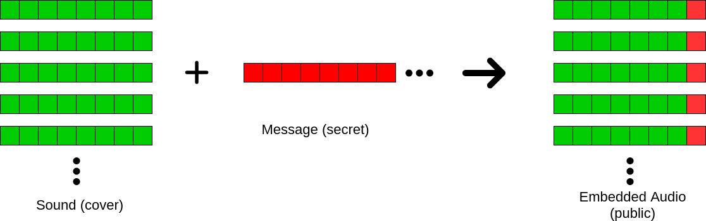
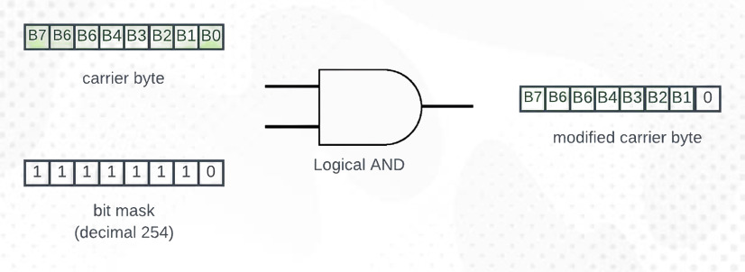
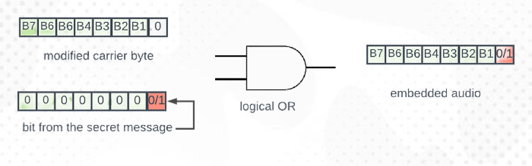
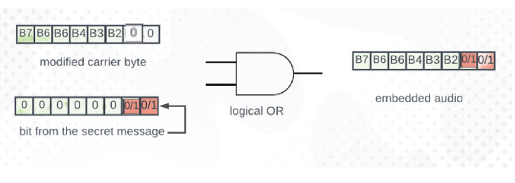
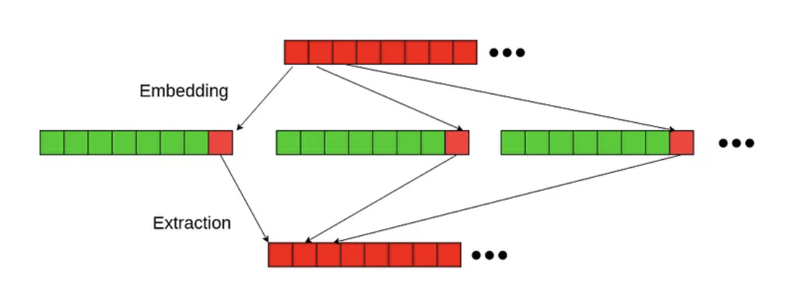
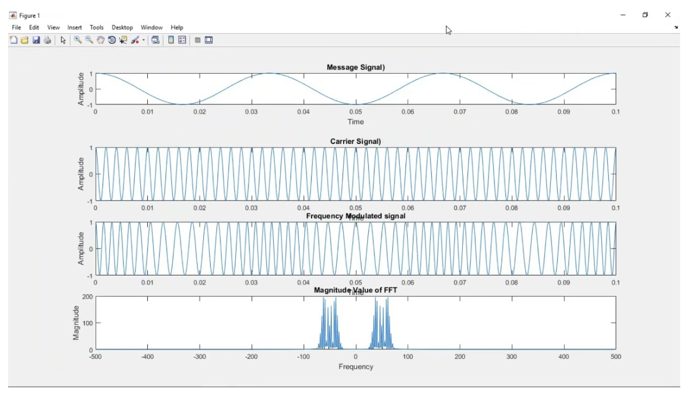
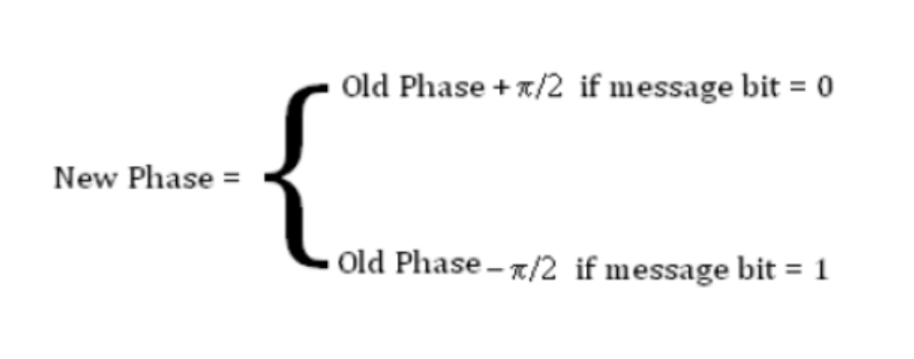

# Audio Steganography

### By: Abigail Lin, Naomi Steinmetz, Otzar Jaffe


## What is Audio Steganography?

Audio Steganography refers to the art of hiding information in audio files. This is different
from encryption, as it relies on the assumption that people won’t know to look for the secret
message in the chosen vector, which is audio.

This has applications beyond allowing for simple messages to be sent like most other
common encryption methods. It can be used to:

```
● Track User Data
● Hide Malware
● Trigger Smart Home Devices
```

## LSB Encoding (1- bit)

This works by converting the audio (a .wav file) into bytes, and changing the least significant
bit of each byte with a bit from the message file.
 

## LSB Encoding (1-bit)

We will use bit manipulation tool AND with a bit mask (254) to clear the least significant bit
of the audio byte. Then, we can use the tool OR and attach the bit of the secret message to
the audio byte.



## LSB Encoding (2-bit)

We will use bit manipulation tool AND with a bit mask (252) to clear the last two bits of the
audio byte. Then, we can use the tool OR and attach two bits of the secret message to the
audio byte.


## LSB Encoding (Flip Mode)

+ Hide two bits of the message in the 2nd and 3rd bits of each audio byte
+ Optionally flip bits 1 and 0 depending on the conditions, making it harder to scan for/detect

1. Function that looks at bits 2 and 3 of the current byte (x, y) and next two bits of the message (a,
    b) \
       a. If (x, y) = (a, b), do nothing. \
       b. If (x, y) != (a, b), flip bits 0 and 1. 
2. Clear bits 2 and 3 to prepare them
3. Insert message bits into bits 2 and 3 by adding: \
    a. 0 if 00 \
    b. 4 if 01 \
       c. 8 if 10 \
    d. 12 if 11


## LSB Encoding - Under the Shed

1. We prepare the audio’s raw data so that we can modify individual bits in each byte. We
    gather necessary data on: \
       a. Number of channels \
       b. Bytes per sample (Sample width) \
       c. Samples (Number of frames) 
2. We read in the secret message, converting 1 character = 8 bit binary string.
3. Depending on the encoding mode chosen we encode the message.
4. We create a new audio file with the secret message.


## LSB Decoding

In order to extract the data, the decoder will take either the least significant bit, last two bits,
or bits 2 and 3 from each byte of the audio and reconstruct the message.


## Compare Audio Files

**Signal-to-Noise Ratio (SNR):** Measures how strong the original signal is compared to the
added noise (which will appear from changing the LSB)

A higher SNR means that there is a small difference between the two audio signals, which
means that there is a better audio quality preservation. For our current LSB modes, as you
increase the number of bits you change (adding noise), you decrease the SNR. In order of
highest to lowest dB:

1. Same audio (infinite dB)
2. 1-Bit LSB
3. 2-Bit LSB
4. Flipper Mode


## Compare Audio Files - Under the Hood

1. For each sample (raw audio bytes extracted into integers), get the signal power (square
    of the original sample) and noise power (square of the difference between original and
    modified sample).
2. Calculate average of the total signal power and the total noise power

**Signal-to-Noise (dB):** 10 x log10 (signal power / noise power )


## Phase Encoding - Phase Changes


## Phase Encoding - FFT


## Phase Encoding - Phase Shift

